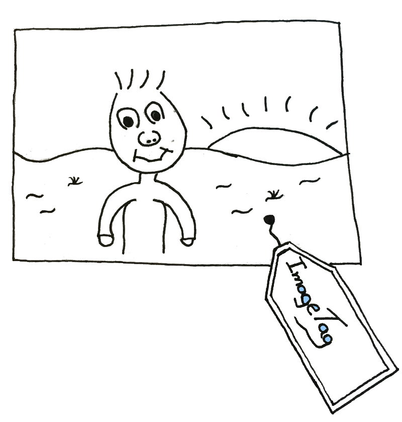

Image Tag - Concept and Design
----------

With many family photos it becomes harder and harder keep track of
them. Image Tag is a piece of software that allows your to set up a
web server (backed by a MySQL database) where you can tag your photos.
Photos can carry as many tags as you like and a presentation pages allows you to 
see all pictures with a particular set of tags.

With this software you images are not part of a folder constituting an
album. Instead each tag is an album and this lightweight mechanism
allows you to separate storage order from presentation of your photos.

Technical Overview
----------

There is a server and a browser client. The server is written in the
[Go](www.golang.org) language while the client is written in
[Dart](www.dartlang.org).

