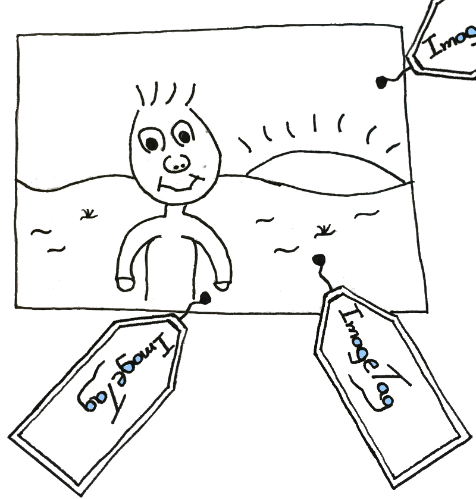

<table border="0">
<tr><td>

</td><td>

</td></tr>
</table>

Image Tag - Concept and Design
----------

With many family photos it becomes harder and harder keep track of
them. Image Tag is a piece of software that allows you to set up a
web server (backed by a MySQL database) where you can tag your photos.
Photos can carry as many tags as you like and a presentation pages allows you to 
see all pictures with a particular set of tags.

The view on the right above depicts the tagging view. Here you browse 
the folder structure of your images. When an image is selected it is 
shown in a larger view with the list of tags assigned to it. You can create new tags,
select a tag and assign it or delete a tag from the selected image.

Technical Overview
----------

There is a server and a browser client. The server is written in the
[Go](http://www.golang.org) language while the client is written in
[Dart](http://www.dartlang.org).

